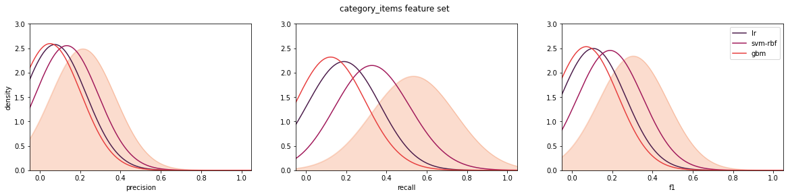

> Martin Fridrich, 03/2021

# Evaluating feature importance

This document strives to inspect effect of individual features & feature sets on the clfs performance in user churn prediction problem. For such a task, we utilize original the proposed user model & benchmarked machine learning pipelines. The endevours are structured as follows:

1 [Housekeepin'](#housekeepin)  
2 [Feature importance](#feature-importance)  
3 [Feature set importance](#feature-set-importance)  

# Housekeepin'

In the opening section, we load most of the libs and the pickled data, strats & models.


```python
# set options
import warnings  
warnings.filterwarnings('ignore')
import pandas as pd
pd.set_option("notebook_repr_html", False)

# general
import numpy as np
import pickle

# plotting
from cairosvg import svg2png
from IPython.display import Image
import matplotlib.pyplot as plt
from matplotlib.colors import rgb2hex
import seaborn as sns

# others
from sklearn.inspection import permutation_importance
from sklearn.experimental import enable_halving_search_cv
from sklearn.model_selection import HalvingGridSearchCV
from sklearn.neighbors import KernelDensity

# metrics
from sklearn.metrics import make_scorer,accuracy_score, recall_score, precision_score,\
f1_score, roc_auc_score, roc_curve
```


```python
pf = open("../data/benchmark-cache.pickle","rb")
classification_data, skf, score_dict = pickle.load(pf)
pf.close()
features = classification_data.loc[:,"ses_rec":"int_cat24_n"].columns
```

# Feature importance

To assess the contribution of individual features to the model's performance, we use a permutation importance procedure. In short, it describes a change in a pipeline's performance when an explanatory variable is randomly shuffled. Thus, it indicates how much the machine learning solution is dependent on that characteristic. We decide to examine changes in both train & test performance in roc auc.


```python
# selected clfs
clf_keys = ["lr", "svm-rbf", "gbm"]

# feature importance on train & test set
split_get = skf.split(classification_data.loc[:,"ses_rec":"int_cat24_n"],
    classification_data.target_class)

importance_df = pd.DataFrame(columns=list(features)+["type", "pipe"])
for i, s in zip(range(skf.get_n_splits()), split_get):
    for k, v in {"train":s[0], "test":s[1]}.items():
        for e in clf_keys:
            temp_imp = permutation_importance(score_dict[e]["estimator"][i],
                X=classification_data[features].iloc[v,:], y=classification_data.target_class[v],
                scoring="roc_auc",n_repeats=10, n_jobs=8).importances
            temp_df = pd.DataFrame(dict(zip(features, temp_imp)))
            temp_df["type"] = k
            temp_df["pipe"] = e
            importance_df = importance_df.append(temp_df)

# diff value
agg_imp_df = importance_df.groupby(["type", "pipe"]).mean().transpose()
# diff/importance rank
importance_rank_df = importance_df.apply(lambda x: x[features].rank(ascending=False, method="max"), axis=1)
importance_rank_df = pd.concat([importance_rank_df, importance_df[["type","pipe"]]], axis=1) 
agg_rank_df = importance_rank_df.groupby(["type","pipe"]).mean().transpose()
```


```python
ft_df = pd.melt(importance_df,id_vars=["type","pipe"], var_name="feature", value_name="diff")
fig, axs = plt.subplots(1, 3, figsize=(20,6))
for k, ax in zip(clf_keys, axs.flatten()):  
    tf = agg_imp_df.loc[:,"test"][k].sort_values(ascending=False).index[:10].values
    cf = np.logical_and(ft_df["pipe"]==k, [f in tf for f in ft_df.feature])
    g = sns.boxplot(x="feature", y="diff",
        hue="type", palette="rocket",
        data=ft_df[cf], ax=ax, order=tf)
    g.set_title(k)
    g.set_xlabel("")
    g.set_xticklabels(g.get_xticklabels(), rotation = 90)
    g.set_ylabel("")
    g.set_ylim(-0.025, 0.175)
    g.legend([],[], frameon=False)
axs[0].set_ylabel("auc diff") 
axs[2].legend(loc="upper right");
fig.tight_layout();
```


    

    


The charts above show us how the performance wrt train & test set feature permutations differ. The most prominent features across all clfs are `ses_rec`, `ses_n_r`, and `ses_n`. The median differences range from 0.005-0.105, with a more considerable variance on the test set. Apart from recency + frequency sets, the clfs appear to rely on category items & datetime variables. The disparity of train-test set measures in the gbm plot is caused by moderate overfit of the model.


```python
ft_df_ = ft_df[ft_df.type=="test"]
fig, axs = plt.subplots(1, 3, figsize=(20,6))
cp = sns.color_palette("rocket", n_colors=4)
for i, (k, ax) in enumerate(zip(clf_keys, axs.flatten())):  
    tf = agg_imp_df.loc[:,"test"][k].sort_values(ascending=False).index[:10].values
    cf = np.logical_and(ft_df["pipe"]==k, [f in tf for f in ft_df.feature])
    g = sns.boxplot(x="feature", y="diff",
        color=cp[i],
        data=ft_df_[cf], ax=ax, order=tf)
    g.set_title(k)
    g.set_xlabel("")
    g.set_xticklabels(g.get_xticklabels(), rotation = 90)
    g.set_ylabel("")
    g.set_ylim(-0.025, 0.15)
    g.legend([],[], frameon=False)
    g.axhline(0, c="gray", linestyle="dotted")
axs[0].set_ylabel("auc diff") 
#axs[2].legend(loc="upper right");
fig.tight_layout();
```


    

    


```python
ft_df_ = ft_df[ft_df.type=="test"]
fig, axs = plt.subplots(1, 3, figsize=(20,6))
cp = sns.color_palette("rocket", n_colors=4)
for i, (k, ax) in enumerate(zip(clf_keys, axs.flatten())):  
    tf = agg_imp_df.loc[:,"test"][k].sort_values(ascending=False).index[:5].values
    cf = np.logical_and(ft_df["pipe"]==k, [f in tf for f in ft_df.feature])
    g = sns.boxplot(x="feature", y="diff",
        color=cp[i],
        data=ft_df_[cf], ax=ax, order=tf)
    g.set_title(k)
    g.set_xlabel("")
    g.set_xticklabels(g.get_xticklabels(), rotation = 90)
    g.set_ylabel("")
    g.set_ylim(-0.025, 0.15)
    g.legend([],[], frameon=False)
    g.axhline(0, c="gray", linestyle="dotted")
axs[0].set_ylabel("auc diff") 
#axs[2].legend(loc="upper right");
fig.tight_layout();
```


    

    


```python
# bootastraped means and intervals
prc_ls = [.0005, .005, .025, .05, .95, .975, .995, .9995]
prnt_ls = ["mean","0.5%", "99.5%"]

ind_bootstrap_df = pd.concat([ft_df_.groupby(["pipe","feature"]).\
    sample(frac=1, replace=True, random_state=i).\
    groupby(["pipe","feature"]).mean()for i in range(1000)])

# exp individual importance
ind_bootstrap_df.groupby(["pipe","feature"]).describe(percentiles=prc_ls).\
    to_csv("../data/ecom-user-churn-ind-imp-ci.csv")
# printout
ind_bootstrap_df.groupby(["pipe","feature"]).describe(percentiles=prc_ls).\
    loc[:,pd.IndexSlice[:,["mean","0.5%","99.5%"]]]        
```


                                  diff                            
                                  mean          0.5%         99.5%
    pipe    feature                                               
    gbm     int_cat10_n   1.100926e-04  1.681332e-05  2.057802e-04
            int_cat11_n   2.978848e-07 -6.182468e-06  7.311665e-06
            int_cat12_n  -1.119279e-04 -2.865047e-04  5.190931e-05
            int_cat13_n   4.226995e-06 -8.286304e-06  1.890073e-05
            int_cat15_n   8.265039e-08  3.244373e-08  1.541483e-07
    ...                            ...           ...           ...
    svm-rbf time_to_int   1.159037e-04 -3.528934e-04  5.767174e-04
            time_to_tran -1.186572e-04 -3.866905e-04  1.452877e-04
            tran_n       -1.355719e-04 -3.889880e-04  1.246025e-04
            tran_n_r     -1.329260e-04 -3.863165e-04  1.212955e-04
            user_rec      4.215175e-03  3.620067e-03  4.805712e-03
    
    [141 rows x 3 columns]


```python
# p-vals on means, null hypothesis mean characteristic higher than zero
pind_bootstrap_df = ind_bootstrap_df.groupby(["pipe","feature"]).apply(lambda x: x>0).\
    astype("float").groupby(["pipe","feature"]).mean()
# export
pind_bootstrap_df.to_csv("../data/ecom-user-churn-ind-imp-pval.csv")
# printout
pind_bootstrap_df
```


                           diff
    pipe    feature            
    gbm     int_cat10_n   0.998
            int_cat11_n   0.535
            int_cat12_n   0.046
            int_cat13_n   0.791
            int_cat15_n   1.000
    ...                     ...
    svm-rbf time_to_int   0.742
            time_to_tran  0.142
            tran_n        0.098
            tran_n_r      0.095
            user_rec      1.000
    
    [141 rows x 1 columns]


# Feature set importance

To evaluate the set importance, we treat a set as predictions of the most influential features. Thus, we are able measure precision & recall for each feature group. Let us have a set of features $G$, set of n most influential features $F_n$, then:

$pre_G = \frac{|\{g|g \in F_n\}|}{|G|}$,  
$rec_G = \frac{|\{g|g \in F_n\}|}{n}$,  
$f1_G = \frac{2 \cdot pre_G \cdot rec_G}{pre_G+rec_G}$.  

We combine the outlined idea with monte-carlo to construct distribution for the metrics at hand. The proposed procedure is as follows: (1) draw random 10^5 permutations of the rank vector, (2) compute pre-rec point estimate for each vector, (3) form the pre-rec distributions from the point estimates. Consequently, we are able to place observed classifier feature preference to the random feature preference.


```python
# feature set map
fg_map = [("recency","ses_rec"), ("recency","ses_rec_avg"), ("recency","ses_rec_sd"),
("recency","ses_rec_cv"), ("recency","user_rec"),
("frequency","ses_n"), ("frequency","ses_n_r"), ("frequency","int_n"),
("frequency","int_n_r"), ("frequency","tran_n"), ("frequency","tran_n_r"),
("monetary","rev_sum"), ("monetary","rev_sum_r"), ("monetary","major_spend_r"),
("category_items","int_cat_n_avg"), ("category_items","int_itm_n_avg"),
("category_items","int_cat1_n"),("category_items","int_cat2_n"),("category_items","int_cat3_n"),
("category_items","int_cat4_n"), ("category_items","int_cat5_n"),("category_items","int_cat6_n"),
("category_items","int_cat7_n"), ("category_items","int_cat8_n"),("category_items","int_cat9_n"),
("category_items","int_cat10_n"),("category_items","int_cat11_n"), ("category_items","int_cat12_n"),
("category_items","int_cat13_n"), ("category_items","int_cat14_n"), ("category_items","int_cat15_n"),
("category_items","int_cat16_n"), ("category_items","int_cat17_n"), ("category_items","int_cat18_n"),
("category_items","int_cat19_n"), ("category_items","int_cat20_n"), ("category_items","int_cat21_n"),
("category_items","int_cat22_n"), ("category_items","int_cat23_n"), ("category_items","int_cat24_n"),
("datetime","ses_mo_avg"), ("datetime","ses_mo_sd"), ("datetime","ses_ho_avg"),
("datetime","ses_ho_sd"), ("datetime","ses_wknd_r"),
("others","ses_len_avg"), ("others","time_to_int"), ("others","time_to_tran")]
fg_dict = dict((e[1],e[0]) for e in fg_map if e[1] in ft_df.feature.unique())
```


```python
# monte-carlo & reshapes
def shape_rank(df, fg=fg_dict, recolumn=False):
    df.reset_index(drop=True, inplace=True)
    df.index = ["iter_"+str(c) for c in df.index]
    if recolumn:
        df.columns = fg.keys()
    df = df[fg.keys()]
    df = df.T
    df["group"] = df.index.map(fg)
    return df

def pre_rec(df, k=10):
    ic = [c for c in df.columns if "iter" in c]
    hits_df = (df.loc[:,ic]<=k).sum()
    pre = hits_df/df.shape[0]
    rec = hits_df/k
    res_df = pd.DataFrame({"precision":pre, "recall":rec,
        "f1":(2*pre*rec/(pre+rec+0.0001))})
    res_df = res_df.apply(pd.to_numeric)
    return res_df    

mc_ls = []
for i in range(10**4):
    arr = np.arange(len(fg_dict))+1
    np.random.seed(i)
    np.random.shuffle(arr)
    mc_ls.append(arr)
mc_df = pd.DataFrame(mc_ls)
mc_df = shape_rank(mc_df, fg_dict, True)

mcm_df = mc_df.groupby(mc_df.group).apply(pre_rec, 10)
mcm_df.index.set_names(["feature_set","iter"], inplace=True)
mcm_df.reset_index(inplace=True)

# check the results
feature_sets = ["recency", "frequency", "monetary", "category_items", "datetime", "others"]
#display(mcm_df.groupby("feature_set").precision.describe(percentiles=prc_ls)[prnt_ls])
#display(mcm_df.groupby("feature_set").recall.describe(percentiles=prc_ls)[prnt_ls])
mcm_df.groupby("feature_set").describe(percentiles=prc_ls).loc[:,pd.IndexSlice[:,prnt_ls]]
```


                   precision                   recall                   f1  \
                        mean  0.5%     99.5%     mean 0.5% 99.5%      mean   
    feature_set                                                              
    category_items  0.212996  0.08  0.360000  0.53249  0.2   0.9  0.304239   
    datetime        0.212160  0.00  0.800000  0.10608  0.0   0.4  0.141408   
    frequency       0.212517  0.00  0.666667  0.12751  0.0   0.4  0.159351   
    monetary        0.212200  0.00  1.000000  0.06366  0.0   0.3  0.097920   
    others          0.212733  0.00  1.000000  0.06382  0.0   0.3  0.098166   
    recency         0.212880  0.00  0.600000  0.10644  0.0   0.3  0.141888   
    
                                        
                        0.5%     99.5%  
    feature_set                         
    category_items  0.114245  0.514245  
    datetime        0.000000  0.533289  
    frequency       0.000000  0.499953  
    monetary        0.000000  0.461503  
    others          0.000000  0.461503  
    recency         0.000000  0.399956  


We can see that sets with the high potential importance are the largest, with the most notable contributors in `category_items`, `frequency`, `recency` or `datetime`.


```python
o_ls = []
for c in clf_keys:
    cf = (importance_rank_df["type"]=="test") & (importance_rank_df["pipe"]==c)
    df = shape_rank(importance_rank_df.loc[cf, list(fg_dict.keys())])
    df = df.groupby("group").apply(pre_rec)
    df.index = pd.MultiIndex.from_tuples([(c, cat, it) for cat, it in df.index.values],
        names=["clf","feature_set","iter"])
    o_ls.append(df)
om_df = pd.concat(o_ls).reset_index()
om_df.groupby(["clf","feature_set"]).mean().loc[pd.IndexSlice[:, feature_sets],:] # observed means
```


                            precision  recall        f1
    clf     feature_set                                
    gbm     recency          0.805000  0.4025  0.536622
    lr      recency          0.863000  0.4315  0.575289
    svm-rbf recency          0.651000  0.3255  0.433956
    gbm     frequency        0.413333  0.2480  0.309953
    lr      frequency        0.524167  0.3145  0.393078
    svm-rbf frequency        0.362500  0.2175  0.271830
    gbm     monetary         0.001667  0.0005  0.000769
    lr      monetary         0.000000  0.0000  0.000000
    svm-rbf monetary         0.001667  0.0005  0.000769
    gbm     category_items   0.050600  0.1265  0.072252
    lr      category_items   0.074200  0.1855  0.105963
    svm-rbf category_items   0.134000  0.3350  0.191388
    gbm     datetime         0.406000  0.2030  0.270624
    lr      datetime         0.137000  0.0685  0.091308
    svm-rbf datetime         0.225000  0.1125  0.149963
    gbm     others           0.065000  0.0195  0.029995
    lr      others           0.000000  0.0000  0.000000
    svm-rbf others           0.026667  0.0080  0.012306


```python
# bootastraped means and intervals
set_bootstrap_df = pd.concat([om_df.groupby(["clf","feature_set"]).\
    sample(frac=1, replace=True, random_state=i).\
    groupby(["clf","feature_set"]).mean()for i in range(1000)])

# exp set importance
set_bootstrap_df.groupby(["clf","feature_set"]).describe(percentiles=prc_ls).\
    to_csv("../data/ecom-user-churn-set-imp-ci.csv")    

# printout
set_bootstrap_df.groupby(["clf","feature_set"]).describe(percentiles=prc_ls).\
    loc[pd.IndexSlice[:,feature_sets],pd.IndexSlice[:,["mean","0.5%","99.5%"]]]    
```


                           precision                        recall            \
                                mean      0.5%     99.5%      mean      0.5%   
    clf     feature_set                                                        
    gbm     recency         0.804822  0.774000  0.832000  0.402411  0.387000   
    lr      recency         0.863364  0.842000  0.886000  0.431682  0.421000   
    svm-rbf recency         0.650572  0.621990  0.681005  0.325286  0.310995   
    gbm     frequency       0.413514  0.393329  0.434171  0.248109  0.235998   
    lr      frequency       0.524424  0.501667  0.544167  0.314654  0.301000   
    svm-rbf frequency       0.362452  0.334158  0.388342  0.217471  0.200495   
    gbm     monetary        0.001643  0.000000  0.006667  0.000493  0.000000   
    lr      monetary        0.000000  0.000000  0.000000  0.000000  0.000000   
    svm-rbf monetary        0.001668  0.000000  0.006675  0.000500  0.000000   
    gbm     category_items  0.050590  0.044999  0.056200  0.126476  0.112498   
    lr      category_items  0.074201  0.067598  0.081001  0.185503  0.168995   
    svm-rbf category_items  0.134139  0.126199  0.141600  0.335347  0.315497   
    gbm     datetime        0.405978  0.375000  0.437000  0.202989  0.187500   
    lr      datetime        0.137339  0.111990  0.165000  0.068669  0.055995   
    svm-rbf datetime        0.225169  0.200990  0.257005  0.112585  0.100495   
    gbm     others          0.065055  0.038333  0.096675  0.019517  0.011500   
    lr      others          0.000000  0.000000  0.000000  0.000000  0.000000   
    svm-rbf others          0.027013  0.008333  0.048333  0.008104  0.002500   
    
                                            f1                      
                               99.5%      mean      0.5%     99.5%  
    clf     feature_set                                             
    gbm     recency         0.416000  0.536504  0.515956  0.554622  
    lr      recency         0.443000  0.575532  0.561289  0.590622  
    svm-rbf recency         0.340502  0.433670  0.414616  0.453959  
    gbm     frequency       0.260502  0.310089  0.294950  0.325581  
    lr      frequency       0.326500  0.393271  0.376203  0.408078  
    svm-rbf frequency       0.233005  0.271794  0.250574  0.291211  
    gbm     monetary        0.002000  0.000758  0.000000  0.003076  
    lr      monetary        0.000000  0.000000  0.000000  0.000000  
    svm-rbf monetary        0.002002  0.000770  0.000000  0.003080  
    gbm     category_items  0.140500  0.072238  0.064253  0.080251  
    lr      category_items  0.202503  0.105965  0.096532  0.115678  
    svm-rbf category_items  0.354000  0.191586  0.180243  0.202245  
    gbm     datetime        0.218500  0.270609  0.249958  0.291289  
    lr      datetime        0.082500  0.091534  0.074639  0.109971  
    svm-rbf datetime        0.128503  0.150076  0.133958  0.171298  
    gbm     others          0.029002  0.030020  0.017689  0.044612  
    lr      others          0.000000  0.000000  0.000000  0.000000  
    svm-rbf others          0.014500  0.012466  0.003845  0.022304  


```python
# p-vals on means, null hypothesis mean characteristic higher than zero
pset_bootstrap_df = set_bootstrap_df.groupby(["clf","feature_set"]).apply(lambda x: x>0).\
    astype("float").groupby(["clf","feature_set"]).mean().loc[pd.IndexSlice[:,feature_sets],:]
# export
pset_bootstrap_df.to_csv("../data/ecom-user-churn-set-imp-pval.csv")
# printout
pset_bootstrap_df
```


                            precision  recall     f1
    clf     feature_set                             
    gbm     recency             1.000   1.000  1.000
    lr      recency             1.000   1.000  1.000
    svm-rbf recency             1.000   1.000  1.000
    gbm     frequency           1.000   1.000  1.000
    lr      frequency           1.000   1.000  1.000
    svm-rbf frequency           1.000   1.000  1.000
    gbm     monetary            0.649   0.649  0.649
    lr      monetary            0.000   0.000  0.000
    svm-rbf monetary            0.618   0.618  0.618
    gbm     category_items      1.000   1.000  1.000
    lr      category_items      1.000   1.000  1.000
    svm-rbf category_items      1.000   1.000  1.000
    gbm     datetime            1.000   1.000  1.000
    lr      datetime            1.000   1.000  1.000
    svm-rbf datetime            1.000   1.000  1.000
    gbm     others              1.000   1.000  1.000
    lr      others              0.000   0.000  0.000
    svm-rbf others              1.000   1.000  1.000


We reject the null hypothesis only for the monetary feature set with importance described by `lr` and `gbm`. Mean point estimates for other sets & metrics appear to be higher than zero. Now, we take a look on difference in means between the observed and reference importance set measures.


```python
# bootstrapped observed - reference
set_diff_bootstrap_df = pd.concat([om_df.groupby(["clf","feature_set"]).\
    sample(frac=1, replace=True, random_state=i).groupby(["clf","feature_set"]).mean()-\
    mcm_df.groupby("feature_set").sample(frac=1, replace=True, random_state=i).\
        groupby("feature_set").mean() for i in range(1000)])
# exp
set_diff_bootstrap_df.groupby(["clf","feature_set"]).describe(percentiles=prc_ls).\
    to_csv("../data/ecom-user-churn-set-diff.csv")
# printout        
set_diff_bootstrap_df.groupby(["clf","feature_set"]).describe(percentiles=prc_ls).\
    loc[pd.IndexSlice[:,feature_sets],pd.IndexSlice[:,["mean","0.5%","99.5%"]]] 
```


                           precision                        recall            \
                                mean      0.5%     99.5%      mean      0.5%   
    clf     feature_set                                                        
    gbm     recency         0.591979  0.561139  0.619262  0.295989  0.280570   
    lr      recency         0.650521  0.628359  0.671782  0.325260  0.314180   
    svm-rbf recency         0.437729  0.409233  0.470240  0.218864  0.204617   
    gbm     frequency       0.200929  0.179099  0.223303  0.120557  0.107459   
    lr      frequency       0.311839  0.288583  0.333617  0.187103  0.173150   
    svm-rbf frequency       0.149866  0.122209  0.176246  0.089920  0.073325   
    gbm     monetary       -0.210562 -0.217135 -0.203466 -0.063169 -0.065141   
    lr      monetary       -0.212206 -0.218433 -0.205733 -0.063662 -0.065530   
    svm-rbf monetary       -0.210537 -0.217301 -0.203031 -0.063161 -0.065190   
    gbm     category_items -0.162399 -0.168376 -0.156456 -0.405997 -0.420940   
    lr      category_items -0.138788 -0.145689 -0.132203 -0.346970 -0.364222   
    svm-rbf category_items -0.078850 -0.086934 -0.071359 -0.197126 -0.217335   
    gbm     datetime        0.193725  0.161197  0.225443  0.096862  0.080599   
    lr      datetime       -0.074914 -0.099855 -0.047434 -0.037457 -0.049927   
    svm-rbf datetime        0.012916 -0.012564  0.043621  0.006458 -0.006282   
    gbm     others         -0.147622 -0.174168 -0.114729 -0.044287 -0.052251   
    lr      others         -0.212677 -0.218667 -0.206900 -0.063803 -0.065600   
    svm-rbf others         -0.185664 -0.206567 -0.162932 -0.055699 -0.061970   
    
                                            f1                      
                               99.5%      mean      0.5%     99.5%  
    clf     feature_set                                             
    gbm     recency         0.309631  0.394640  0.374080  0.412829  
    lr      recency         0.335891  0.433668  0.418894  0.447842  
    svm-rbf recency         0.235120  0.291806  0.272809  0.313481  
    gbm     frequency       0.133982  0.150686  0.134314  0.167467  
    lr      frequency       0.200170  0.233869  0.216427  0.250202  
    svm-rbf frequency       0.105748  0.112391  0.091649  0.132176  
    gbm     monetary       -0.061040 -0.097164 -0.100197 -0.093890  
    lr      monetary       -0.061720 -0.097923 -0.100796 -0.094936  
    svm-rbf monetary       -0.060909 -0.097153 -0.100274 -0.093689  
    gbm     category_items -0.391140 -0.231991 -0.240529 -0.223502  
    lr      category_items -0.330508 -0.198265 -0.208121 -0.188859  
    svm-rbf category_items -0.178397 -0.112643 -0.124192 -0.101941  
    gbm     datetime        0.112721  0.129138  0.107455  0.150284  
    lr      datetime       -0.023717 -0.049936 -0.066559 -0.031619  
    svm-rbf datetime        0.021811  0.008606 -0.008378  0.029074  
    gbm     others         -0.034419 -0.068120 -0.080370 -0.052941  
    lr      others         -0.062070 -0.098140 -0.100904 -0.095474  
    svm-rbf others         -0.048880 -0.085675 -0.095321 -0.075185  


In addition, we examine the p-values for the mean differences, where null hypothesis stands that the difference in means is not positive, i.e., the observed importance metric shows same or lower value than randomly observed importance of a set of the same size. 


```python
# p-vals to the boostraped diff
pset_diff_bootstrap_df = set_diff_bootstrap_df.groupby(["clf","feature_set"]).apply(lambda x: x<=0).\
    astype("float").groupby(["clf","feature_set"]).mean().loc[pd.IndexSlice[:,feature_sets],:]
# export
pset_diff_bootstrap_df.to_csv("../data/ecom-user-churn-set-diff-pval.csv")
# printout
pset_diff_bootstrap_df    
```


                            precision  recall     f1
    clf     feature_set                             
    gbm     recency             0.000   0.000  0.000
    lr      recency             0.000   0.000  0.000
    svm-rbf recency             0.000   0.000  0.000
    gbm     frequency           0.000   0.000  0.000
    lr      frequency           0.000   0.000  0.000
    svm-rbf frequency           0.000   0.000  0.000
    gbm     monetary            1.000   1.000  1.000
    lr      monetary            1.000   1.000  1.000
    svm-rbf monetary            1.000   1.000  1.000
    gbm     category_items      1.000   1.000  1.000
    lr      category_items      1.000   1.000  1.000
    svm-rbf category_items      1.000   1.000  1.000
    gbm     datetime            0.000   0.000  0.000
    lr      datetime            1.000   1.000  1.000
    svm-rbf datetime            0.109   0.109  0.109
    gbm     others              1.000   1.000  1.000
    lr      others              1.000   1.000  1.000
    svm-rbf others              1.000   1.000  1.000


From the print-out above, we see that only `recency` and `frequency` outperform the referential distributions in all metrics & classifiers on p<0.001. Datetime group appears to be also significant for more complex `svm-rbf` and `gbm`.


```python
# predef
X_plot = np.linspace(-0.1,1.1,1000)
cv_params = {"bandwidth":np.linspace(0.15,1.5,100), "kernel":["gaussian"]}
cp = sns.color_palette("rocket", n_colors=4)
metric_keys = ["precision", "recall", "f1"]

def get_kde(X_train, X_predict, cv_grid=None, **cv_kwargs):
    X_train = X_train.values.reshape(-1,1)
    cv = HalvingGridSearchCV(KernelDensity(),
        param_grid=cv_grid, **cv_kwargs).fit(X_train)
    y_predict = cv.score_samples(X_predict.reshape(-1,1))
    return np.exp(y_predict)

# plot reference distribution
for s in feature_sets:
    mcf = mcm_df.feature_set==s
    ocf = om_df.feature_set==s
    fig, axs = plt.subplots(1,3, figsize=(20,4))
    for m, ax in zip(metric_keys, axs):
        mcm_kde = get_kde(mcm_df[mcf][m], X_plot,
            cv_grid=cv_params, n_jobs=8, max_resources=1000)
        sns.lineplot(x=X_plot,y=mcm_kde, alpha=0.35, ax=ax, color=cp[3])
        ax.fill_between(X_plot,mcm_kde, color=cp[3], alpha=0.35)
        for i, c in enumerate(clf_keys):
            om_kde = get_kde(om_df[(ocf) & (om_df.clf==c)][m], X_plot,
                cv_grid=cv_params, n_jobs=8)
            sns.lineplot(x=X_plot,y=om_kde, ax=ax, color=cp[i], label=c,
                legend=False)
        ax.set_xlim(-0.05,1.05)
        ax.set_xlabel(m)
        ax.set_ylim(0,3)
        ax.set_ylabel("")
    fig.suptitle(s + " feature set")
    axs[0].set_ylabel("density")
    axs[2].legend(loc="upper right")
    plt.show()
```


    

    


    

    


    

    


    

    


    

    


    

    


In the plots above, we identify four types of the set importance behavior: (1) group over-performs monte-carlo ranks, examples - recency, frequency, suggestion - stabilize the precision (feature preselection) (2) under-performing the simulation; however, still somewhat functional, examples - category_items, suggestion - improve the precision (preselection, dense representation), (3) datetime set performs on par with random ranks, suggestion - NA (4) others & monetary groups are vastly under-performing, suggestion - omit.
