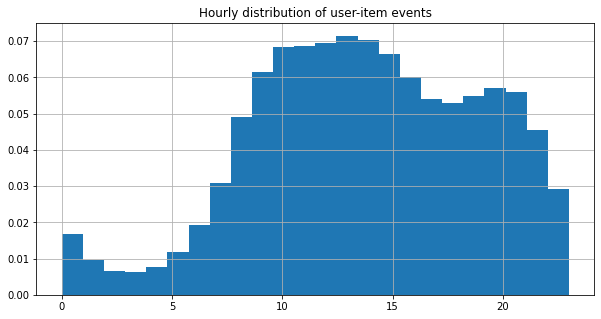
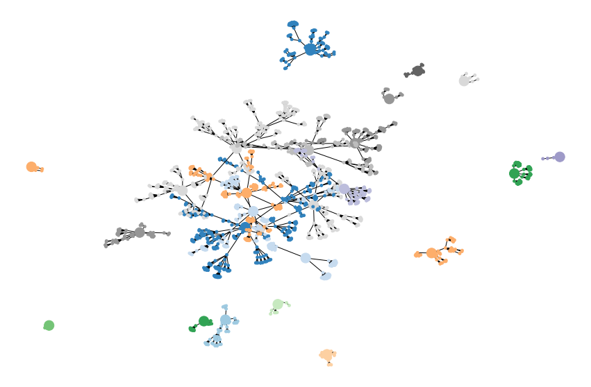
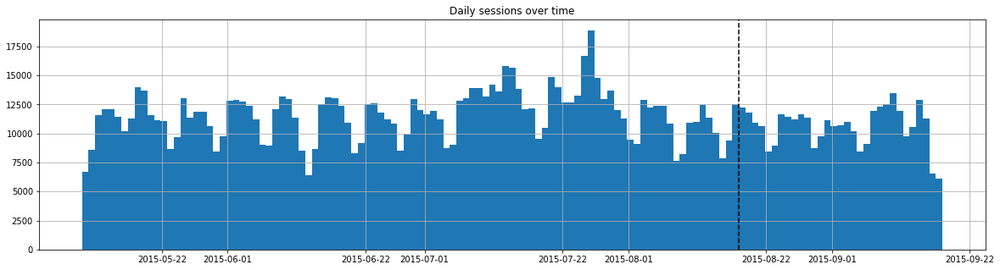
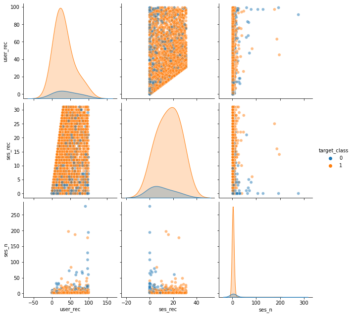

> Martin Fridrich, 03/2021

# User churn model in e-commerce retail

This notebook strives to form a dataset for a user/customer churn prediction problem in an e-commerce environment. It is based on open [Kaggle - Retail rocket dataset](https://www.kaggle.com/retailrocket/ecommerce-dataset).

The churn event (explained variable) is a binary indicator of the user's interaction/no interaction during the subsequent month. The user model (explanatory variables) is based on previous user-item interaction/actions on the website, i.e., days from the last session, average session length, etc. The user model consists of six sets of attributes: recency, frequency, monetary, category & item, datetime, and other characteristics. The design of the user model is verified with a machine learning pipeline.

The notebook is structured as follows:  

1 [Data loading](#data-loading)  
2 [Data transformation](#data-transformation)  
3 [User churn model & response](#user-churn-model--response)  
4 [Modeling](#modeling)  
5 [Conclusion](#conclusion)  
6 [References](#references)

Note: EDA part of the project is limited to the minimum to keep the document straightforward. First of all, let' us check the working directory and load the required libs.


```python
# set options
import warnings  
warnings.filterwarnings('ignore')
import pandas as pd
pd.set_option("notebook_repr_html", False)

# load libs
import numpy as np
import networkx as nx
import dask.dataframe as dd
import datetime
import matplotlib.pyplot as plt
import re
import seaborn as sns
```

# Data loading

In the following code chunks we load the `item_properties`, `events`, `category_tree` datasets into the environment. A couple of basic operations such as data union, type conversion, or ensuring datasets integrity are carried out. Memory is freed of temp vars, and resulting data frames can be examined in the console output.


```python
# load in raw data
item_properties_1 = pd.read_csv("../data/retail-rocket/item_properties_part1.csv",
                               dtype={"itemid":np.int32})

item_properties_2 = pd.read_csv("../data/retail-rocket/item_properties_part2.csv",
                               dtype={"itemid":np.int32})

events = pd.read_csv("../data/retail-rocket/events.csv",
                    dtype={"visitorid":np.int32,
                           "transactionid":np.float32,
                           "itemid":np.int32})

category_tree = pd.read_csv("../data/retail-rocket/category_tree.csv")                           
```


```python
# item properties
item_properties = pd.concat([item_properties_1, item_properties_2],
                           ignore_index=True)

# get only items relevant to events & price + cat properties
item_properties = item_properties[item_properties.property.isin(["categoryid","790"]) & 
                                  item_properties.itemid.isin(events.itemid.unique())]

# clean-up values & property data types
item_properties.value = item_properties.value.str.replace("n","").astype("float")
item_properties.property = item_properties.property.map({"790":"price",
                                                         "categoryid":"categoryid"})

# similarily, clean up events
events = events[events.itemid.isin(item_properties.itemid.unique())]

# del unused vars
del item_properties_1, item_properties_2

# examine results
display(events.info())
display(item_properties.info())
display(category_tree.info())
```

    <class 'pandas.core.frame.DataFrame'>
    Int64Index: 2500516 entries, 0 to 2756100
    Data columns (total 5 columns):
     #   Column         Dtype  
    ---  ------         -----  
     0   timestamp      int64  
     1   visitorid      int32  
     2   event          object 
     3   itemid         int32  
     4   transactionid  float32
    dtypes: float32(1), int32(2), int64(1), object(1)
    memory usage: 85.8+ MB


    None


    <class 'pandas.core.frame.DataFrame'>
    Int64Index: 1650853 entries, 0 to 20275890
    Data columns (total 4 columns):
     #   Column     Non-Null Count    Dtype  
    ---  ------     --------------    -----  
     0   timestamp  1650853 non-null  int64  
     1   itemid     1650853 non-null  int32  
     2   property   1650853 non-null  object 
     3   value      1650853 non-null  float64
    dtypes: float64(1), int32(1), int64(1), object(1)
    memory usage: 56.7+ MB


    None


    <class 'pandas.core.frame.DataFrame'>
    RangeIndex: 1669 entries, 0 to 1668
    Data columns (total 2 columns):
     #   Column      Non-Null Count  Dtype  
    ---  ------      --------------  -----  
     0   categoryid  1669 non-null   int64  
     1   parentid    1644 non-null   float64
    dtypes: float64(1), int64(1)
    memory usage: 26.2 KB


    None


Data types seem fine and fit into the memory. There might be some benefits from using the `category` data type; however, current implementation in the `pd` multi-level index does not work correctly with cats :(.

# Data transformation

Over the next couple of cells, we combine user-events and item-properties in a way that reflects ever-changing properties such a price! As a result, every user-item event is linked with the valid price and category of an item. In the next chuck, we use aggregations, shifts, and some boolean logic to collapse `item_properties`.


```python
# form item-prop validity df
max_timestamp = np.max((events.timestamp.max(),item_properties.timestamp.max()))

#
item_properties_sorted = item_properties.sort_values("timestamp")

# previous property value
item_properties_sorted["lag_value"] = item_properties_sorted.groupby(["itemid",
                                            "property"]).value.shift(1) 

# time of next change (end valid time)
item_properties_sorted["lead_timestamp"] = item_properties_sorted.groupby(["itemid",
                                                "property"]).timestamp.shift(-1) 

# is the observation meaningful change?
item_properties_sorted["is_change"] = np.logical_or(item_properties_sorted.lag_value.isna(),
                                            item_properties_sorted.lag_value!=\
                                                    item_properties_sorted.value) 

#
item_properties_sorted = item_properties_sorted[item_properties_sorted.is_change]

# time of the next change (end valid time)
item_properties_sorted["lead_timestamp"] = item_properties_sorted.groupby(["itemid",
                                                "property"]).timestamp.shift(-1)

# fill in missing values
item_properties_sorted["lead_timestamp"].fillna(max_timestamp, inplace=True)

item_properties_sorted["lead_timestamp"] = item_properties_sorted["lead_timestamp"]\
                                                .astype("int64")

# rename
item_properties_sorted.rename({"timestamp":"valid_start",
                               "lead_timestamp":"valid_end"},
                                axis=1, inplace=True)
# filter on cols
item_properties = item_properties_sorted.loc[:,("valid_start", "valid_end",
                                                "itemid", "property", "value")]

# add time valid
item_properties["time_valid"] = item_properties.valid_end - item_properties.valid_start

# clean-up and show res format
del item_properties_sorted, max_timestamp
item_properties.info()
```

    <class 'pandas.core.frame.DataFrame'>
    Int64Index: 705694 entries, 16989434 to 19531148
    Data columns (total 6 columns):
     #   Column       Non-Null Count   Dtype  
    ---  ------       --------------   -----  
     0   valid_start  705694 non-null  int64  
     1   valid_end    705694 non-null  int64  
     2   itemid       705694 non-null  int32  
     3   property     705694 non-null  object 
     4   value        705694 non-null  float64
     5   time_valid   705694 non-null  int64  
    dtypes: float64(1), int32(1), int64(3), object(1)
    memory usage: 35.0+ MB


Following chunks deals with left-joining collapsed `item_properties` on `events`. We ensure that only valid user-event and item-properties are present in the formed dataset.


```python
# add item property to events df
events_enhanced = events.merge(item_properties, on="itemid")

events_enhanced = events_enhanced[
                    np.logical_and(events_enhanced.timestamp>=events_enhanced.valid_start,
                        events_enhanced.timestamp<events_enhanced.valid_end)]

events_enhanced = events_enhanced.loc[:,["timestamp", "visitorid", "itemid",
                                         "event", "property", "value"]]

events_enhanced = events_enhanced.pivot_table(
                        index=["timestamp","visitorid","itemid", "event"],
                        columns="property", values="value",
                        observed=True)

events_enhanced.columns = list(events_enhanced.columns)

events_enhanced = events_enhanced.reset_index()

events_enhanced.rename(index={"property":"index"},
                       inplace=True)

del events
events_enhanced.isnull().sum()
```


    timestamp          0
    visitorid          0
    itemid             0
    event              0
    categoryid    232449
    price          62972
    dtype: int64


We see a significant number of missing values within the `categoryid` and `price` columns. To address the problem, we decided to impute the `NaN`s with values valid over the most extended period.


```python
# fill in missing values
# get properties valid most of the time
top_item_properties = item_properties.groupby(["itemid","property","value"],
                            as_index=False).time_valid.sum().sort_values("time_valid")\
                            .groupby(["itemid","property"]).tail(1)

top_item_properties = top_item_properties.pivot_table(index=["itemid"],
                                              columns="property", values="value",
                                              observed=True).reset_index()

# fill where applicable
events_enhanced = events_enhanced.merge(top_item_properties, on="itemid")

events_enhanced.loc[events_enhanced.categoryid_x.isna(),
                        ["categoryid_x"]] = events_enhanced["categoryid_y"]

events_enhanced.loc[events_enhanced.price_x.isna(),
                        ["price_x"]] = events_enhanced["price_y"]

events_enhanced.rename({"categoryid_x":"categoryid", "price_x":"price"},
                       axis=1, inplace=True)

events_enhanced = events_enhanced.loc[:,["timestamp","visitorid","itemid",
                                         "event", "categoryid", "price"]]

# check the res
events_enhanced.isnull().sum()
del top_item_properties, item_properties
```

Imputation succeeded! Now, let's convert our timestamp `int64` to human-readable format and check the histogram of user-item events over the daily hours.


```python
# timestamps into datetime objects
events_enhanced["datetime"] = pd.to_datetime(events_enhanced.timestamp, unit="ms")-\
                                datetime.timedelta(hours=7)

print("The observations start at {} and end at {}."\
      .format(events_enhanced.datetime.dt.date.min(),
              events_enhanced.datetime.dt.date.max()))

events_enhanced.datetime.dt.hour.hist(bins=24, density=True, figsize=(10,5));
plt.title("Hourly distribution of user-item events");
plt.show();
```

    The observations start at 2015-05-09 and end at 2015-09-17.


    

    


Now, we leverage `category_tree` data to impute low-level categories to respective parent categories. It enables us to track user-item info across parent categories!


```python
# par nodes
par_nodes = category_tree.categoryid[category_tree.parentid.isnull()].values
category_tree = category_tree.dropna()
category_tree.columns = ["from", "to"]
category_tree = category_tree.apply(lambda x: x.astype("int16"), axis=1)
category_tree.info()
```

    <class 'pandas.core.frame.DataFrame'>
    Int64Index: 1644 entries, 0 to 1668
    Data columns (total 2 columns):
     #   Column  Non-Null Count  Dtype
    ---  ------  --------------  -----
     0   from    1644 non-null   int16
     1   to      1644 non-null   int16
    dtypes: int16(2)
    memory usage: 19.3 KB


```python
# closest node func
def get_closest_node(node, search_set):
    """ Return the closest node from the search_set.
        Parameters> node: list, source node, search_set: set, target nodes
        Returns> scalar, the closest node"""
    temp_dict = {key:value for (key, value) in node[1].items() if key in search_set}
    par_node = np.nan
    if bool(temp_dict):
        par_node = min(temp_dict,key=temp_dict.get)
    return par_node

# get network
cat_net = nx.convert_matrix.from_pandas_edgelist(category_tree.dropna(),
            source="from", target="to")

spl = list(nx.algorithms.shortest_path_length(cat_net))

# par dict
par_dict = {node[0]:get_closest_node(node, set(par_nodes)) for node in spl}

# plot it out
plt.figure(figsize=(15,10))
plt.axis("off")
nx.draw_networkx(cat_net,
    pos=nx.spring_layout(cat_net, iterations=75),
    node_size=[200 if n in par_nodes else 15 for n in cat_net.nodes],
    node_color=[par_dict[n] for n in cat_net.nodes],
    cmap=plt.cm.get_cmap('tab20c', 25),
    with_labels=False)
plt.show();    
```


    

    


```python
# finally remap all categories to respective parents
events_enhanced.categoryid = events_enhanced.categoryid.map(par_dict)
par_dict = {par_nodes[i] : "cat" + str(i) for i in range(len(par_nodes))}
events_enhanced.categoryid = events_enhanced.categoryid.map(par_dict)
```

# User churn model & response

In this section, we form user sessions, customer features, and target class. Components are constructed on user data collected within the range `2015-04-01` and `2015-08-20` (inclusive). The observations from `2015-08-20` onwards (last month) are used to create target class labels (visit/no visit).

The natural motivation for using session data is the exploitation of higher-level behavior patterns, not only user-item clicks; a similar approach is applied in Berger & Kompan (2019). Consequently, retrieved user-item interactions are aggregated into customer features.


```python
# sessions
sessions = events_enhanced.sort_values(["visitorid","timestamp"])

sessions["row_number"] = np.arange(len(sessions))

sessions["vis_diff"] = np.logical_or(sessions.visitorid.shift(1).isna(),
                                     sessions.visitorid.shift(1)!=sessions.visitorid)

sessions["time_diff"] = np.logical_or(sessions.datetime.isna(),
                                      (sessions.datetime-
                                       sessions.datetime.shift(1))\
                                      .astype("timedelta64[m]").astype("float")>15)

# session groups
groups = sessions.loc[np.logical_or(sessions.vis_diff, sessions.time_diff),:]

groups.loc[:,"row_end"] = groups.row_number.shift(-1)

groups.loc[groups.row_end.isna(),"row_end"] = len(groups)+1

groups.loc[:,"sessionid"] = np.arange(len(groups))

groups.rename({"row_number":"row_start"},
             axis=1, inplace=True)
               
groups = groups.loc[:,["visitorid", "sessionid", "row_start", "row_end"]]

# merging it together
sessions = sessions.merge(groups, on="visitorid")

sessions = sessions.loc[np.logical_and(sessions.row_number>=sessions.row_start,
                                       sessions.row_number<sessions.row_end),:]

# check res
sessions.info()
del events_enhanced
```

    <class 'pandas.core.frame.DataFrame'>
    Int64Index: 2331221 entries, 0 to 26876868
    Data columns (total 13 columns):
     #   Column      Dtype         
    ---  ------      -----         
     0   timestamp   int64         
     1   visitorid   int64         
     2   itemid      int64         
     3   event       object        
     4   categoryid  object        
     5   price       float64       
     6   datetime    datetime64[ns]
     7   row_number  int64         
     8   vis_diff    bool          
     9   time_diff   bool          
     10  sessionid   int64         
     11  row_start   int64         
     12  row_end     float64       
    dtypes: bool(2), datetime64[ns](1), float64(2), int64(6), object(2)
    memory usage: 217.9+ MB


```python
# to improve devtime, sample sessions data
# sessions = sessions.sample(frac=.01, random_state=20200702)
```


```python
def agg_sessions(input_df):
    """Compute session characteristics such as total number of interactions,
    session start, session length, etc.
        
        Parameters>
            input_df: pd.DataFrame, a session data

        Returns>
            pd.DataFrame, session attributes"""
    
    output_dct = {}
    output_dct["item_n"] = input_df.itemid.nunique()
    output_dct["cat_n"] = input_df.categoryid.nunique()
    output_dct["int_n"] = input_df.shape[0]    
    output_dct["view_n"] = (input_df.event=="view").sum()
    output_dct["cart_n"] = (input_df.event=="addtocart").sum()
    output_dct["tran_n"] = (input_df.event=="transaction").sum()    
    output_dct["view_sp"] = input_df.loc[(input_df.event=="view"),"price"].sum()
    output_dct["cart_sp"] = input_df.loc[(input_df.event=="addtocart"),"price"].sum()
    output_dct["tran_sp"] = input_df.loc[(input_df.event=="transaction"),"price"].sum()    
    output_dct["start_time"] = input_df.datetime.min()
    output_dct["end_time"] = input_df.datetime.max()
    output_dct["len"] = (output_dct["end_time"]-output_dct["start_time"])
    
    return pd.Series(output_dct,
                index=output_dct.keys())

# meta map
agg_sessions_meta = {"item_n":np.int32,
                    "cat_n":np.int16,
                    "int_n":np.int32,
                    "view_n":np.int16,
                    "cart_n":np.int16,
                    "tran_n":np.int16,
                    "view_sp":np.float32,
                    "cart_sp":np.float32,
                    "tran_sp":np.float32,
                    "start_time":"datetime64[s]",
                    "end_time":"datetime64[s]",
                    "len":"timedelta64[s]"}
```


```python
st = datetime.datetime.now()

# dds
dd_sessions = dd.from_pandas(sessions, npartitions=8).persist()
dd_sessions = dd_sessions.categorize(columns="categoryid")

# cats
pivcat_sessions = dd_sessions.pivot_table(index="sessionid",
                                            columns="categoryid",
                                            values="visitorid",
                                            aggfunc="count")

# group-apply
aggregated_sessions = dd_sessions.groupby(["visitorid","sessionid"])\
                            .apply(agg_sessions, meta=agg_sessions_meta)

# others
aggregated_sessions["major_spend"] = aggregated_sessions.tran_sp>\
                            aggregated_sessions.tran_sp.mean()

# compute
aggregated_sessions = aggregated_sessions.compute(scheduler='processes')
pivcat_sessions = pivcat_sessions.compute(scheduler='processes')                                          

# put it together
aggregated_sessions = aggregated_sessions.reset_index()
aggregated_sessions = aggregated_sessions.merge(pivcat_sessions,
                            left_on="sessionid", right_on="sessionid")

se = datetime.datetime.now()
td = (se-st).seconds/60

print("The transformation took {:.2f} mins on the Dask back-end.".format(td))
del dd_sessions, sessions, pivcat_sessions
```

    The transformation took 14.08 mins on the Dask back-end.


The session distribution over time and feature-target split are presented below.


```python
# checkup sessions in train and test splits 
split_time = aggregated_sessions.end_time.max()-datetime.timedelta(days=31)
aggregated_sessions.end_time.hist(bins=(aggregated_sessions.end_time.dt.date.max()-
                                        aggregated_sessions.start_time.dt.date.min()).days,
                                  figsize=(20,5))
plt.axvline(x=split_time,
            linestyle ="--",
            color="k")
plt.title("Daily sessions over time");
plt.show();
```


    

    


```python
def safe_div(a,b):
    """Fix division by zero.
    
        Parameters>
            a: numeric,numerator
            b: numeric, denominator
            
        Returns>
            numeric, division"""
    
    res = np.nan
    if b!=0:
        res = a/b
        
    return res

def agg_customers(input_df, split_time):
    """Compute customer attributes such as account maturity,
    average number of interactions per session, average session length, etc.
    
        Parameters>        
            input_df: pd.DataFrame, a customer data
            split_time: datetime64, feature-target split 
  
        Returns>
            pd.DataFrame, customer features"""
    
    # attributes dict
    output_dct = {}
    
    # recency
    input_df = input_df.sort_values("start_time", ascending=True)
    ses_rec_diff = (input_df.start_time-input_df.start_time.shift(1)).dt.days
    
    output_dct["ses_rec"] = (split_time-input_df.end_time.max()).days
    output_dct["ses_rec_avg"] = np.nanmean(ses_rec_diff)
    output_dct["ses_rec_sd"] = np.nanstd(ses_rec_diff)
    output_dct["ses_rec_cv"] = safe_div(output_dct["ses_rec_sd"],
                                        output_dct["ses_rec_avg"])
    output_dct["user_rec"] = (split_time-input_df.start_time.min()).days   
    
    # frequency
    output_dct["ses_n"] = input_df.shape[0]
    output_dct["ses_n_r"] = safe_div(output_dct["ses_n"],
                                     output_dct["user_rec"])
    output_dct["int_n"] = input_df.int_n.sum()
    output_dct["int_n_r"] = safe_div(output_dct["int_n"],
                                     output_dct["ses_n"])
    output_dct["tran_n"] = input_df.tran_n.sum()
    output_dct["tran_n_r"] = safe_div(output_dct["tran_n"],
                                     output_dct["ses_n"])
    # monetary
    output_dct["rev_sum"] = input_df.tran_sp.sum()
    output_dct["rev_sum_r"] = safe_div(output_dct["rev_sum"],
                                       output_dct["ses_n"])
    output_dct["major_spend_r"] = input_df.major_spend.mean()
    
    # category & item
    output_dct["int_cat_n_avg"] = input_df.cat_n.mean()
    output_dct["int_itm_n_avg"] = input_df.item_n.mean()
    
    # date & time
    output_dct["ses_mo_avg"] = input_df.start_time.dt.month.mean()
    output_dct["ses_mo_sd"] = input_df.start_time.dt.month.std()
    output_dct["ses_ho_avg"] = input_df.start_time.dt.hour.mean()
    output_dct["ses_ho_sd"] = input_df.start_time.dt.hour.std()
    output_dct["ses_wknd_r"] = (input_df.start_time.dt.weekday>4).mean()
    
    # others
    ses_len_d = input_df.len.dt.days.sum() #days
    ses_len_m = input_df.len.dt.seconds.sum()/60 #mins
    
    output_dct["ses_len_avg"] = safe_div(ses_len_m,
                                     output_dct["ses_n"])
    output_dct["time_to_int"] = safe_div(ses_len_m,
                                         output_dct["int_n"])
    output_dct["time_to_tran"] = safe_div(ses_len_d,
                                          output_dct["tran_n"])
    
    return pd.Series(output_dct,
                index=output_dct.keys())
    
# meta map
agg_customers_meta = {"ses_rec":np.float32,                      
                      "ses_rec_avg":np.float32,
                      "ses_rec_sd":np.float32,
                      "ses_rec_cv":np.float32,
                      "user_rec":np.float32,
                      "ses_n":np.int32,
                      "ses_n_r":np.float32,
                      "int_n":np.int32,
                      "int_n_r":np.float32,
                      "tran_n":np.int32,
                      "tran_n_r":np.float32,
                      "rev_sum":np.float32,
                      "rev_sum_r":np.float32,
                      "major_spend_r":np.float32,                   
                      "int_cat_n_avg":np.float32,                                   
                      "int_itm_n_avg":np.float32,                 
                      "ses_mo_avg":np.float32,                     
                      "ses_mo_sd":np.float32,
                      "ses_ho_avg":np.float32,                   
                      "ses_ho_sd":np.float32,
                      "ses_wknd_r":np.float32,
                      "ses_len_avg":np.float32,
                      "time_to_int":np.float32,
                      "time_to_tran":np.float32}
```


```python
st = datetime.datetime.now()

# form the dd
dd_customers = dd.from_pandas(aggregated_sessions[aggregated_sessions.end_time<split_time],
                              npartitions=8).persist()

# group-apply
aggregated_customers = dd_customers.groupby(["visitorid"]).apply(agg_customers,
                            split_time=split_time, meta=agg_customers_meta)

aggregated_customers = aggregated_customers.compute(scheduler='processes')

# cats & stuffs
reg = re.compile(r"cat[0-9]+")
filter_cats = np.array(list(filter(reg.match, dd_customers.columns)))
filter_sort = np.argsort([int(re.search("[0-9]+",c)[0]) for c in filter_cats])
filter_cats = list(filter_cats[filter_sort])
cat_customers = dd_customers[["visitorid"]+filter_cats].groupby("visitorid").sum()
cat_customers = cat_customers.reset_index().compute(scheduler='processes')

# others
cat_customers = cat_customers.apply(lambda x: pd.to_numeric(x, downcast="integer"))
cat_customers.columns =["int_"+c+"_n" if c in filter_cats else c for c in cat_customers.columns]

# put it together
aggregated_customers = aggregated_customers.reset_index()
aggregated_customers = aggregated_customers.merge(cat_customers,
                            left_on="visitorid", right_on="visitorid")
                     
se = datetime.datetime.now()
td = (se-st).seconds/60

print("The transformation took {:.2f} mins on the Dask Dask back-end.".format(td))
del dd_customers, cat_customers
```

    The transformation took 17.38 mins on the Dask Dask back-end.


Now, we construct target class data frame, eventhough we focus on views only, we allow for multiple class prediction in the future (view/addtocart/purchase). This decision is motivated by massive event imbalance.


```python
# form targets
target = aggregated_customers[["visitorid"]].merge(
            aggregated_sessions[aggregated_sessions.end_time>=split_time],
            how="left", on="visitorid")

target.loc[:, "target_class"] = 0 # churned
target.loc[target.int_n>0, "target_class"] = 1
target.loc[target.tran_n>0, "target_class"] = 2

target = target.groupby("visitorid")["target_class"].max().reset_index()
del aggregated_sessions
```

Here we select only recent customers with more then 1 session. Target class vector within the customer features data frame (visit:`0`, no-visit:`1`) is constructed. Moreover, we peek at target class distributions.


```python
# select custs & form the target
classification_data = aggregated_customers.merge(target, on="visitorid")
filter_class = (classification_data.ses_n>1)&(classification_data.ses_rec<=31)
classification_data = classification_data[filter_class]
classification_data["target_class"] = [0 if c>0 else 1 for c in\
                                       classification_data.target_class]

del aggregated_customers, target
classification_data.target_class.value_counts()
```


    1    43711
    0     5647
    Name: target_class, dtype: int64


```python
# fill in blanks & downcast
def downcast_dtype(column_series):
    """Try to infer better dtype.
    
        Parameters>
            column_series: pd.Series, a column to down
            
        Returns>
            pd.Series, converted column"""        
    
    conv_dict = {"int":"integer", "float":"float"}
    for k in conv_dict.keys():
        if k in str(column_series.dtype):
            return pd.to_numeric(column_series, downcast=conv_dict[k])
        
classification_data.fillna(-1, inplace=True)
classification_data = classification_data.apply(downcast_dtype, axis=0)
classification_data.info()
```

    <class 'pandas.core.frame.DataFrame'>
    Int64Index: 49358 entries, 6 to 910123
    Data columns (total 49 columns):
     #   Column         Non-Null Count  Dtype  
    ---  ------         --------------  -----  
     0   visitorid      49358 non-null  int32  
     1   ses_rec        49358 non-null  float32
     2   ses_rec_avg    49358 non-null  float32
     3   ses_rec_sd     49358 non-null  float32
     4   ses_rec_cv     49358 non-null  float32
     5   user_rec       49358 non-null  float32
     6   ses_n          49358 non-null  float32
     7   ses_n_r        49358 non-null  float32
     8   int_n          49358 non-null  float32
     9   int_n_r        49358 non-null  float32
     10  tran_n         49358 non-null  float32
     11  tran_n_r       49358 non-null  float32
     12  rev_sum        49358 non-null  float32
     13  rev_sum_r      49358 non-null  float32
     14  major_spend_r  49358 non-null  float32
     15  int_cat_n_avg  49358 non-null  float32
     16  int_itm_n_avg  49358 non-null  float32
     17  ses_mo_avg     49358 non-null  float32
     18  ses_mo_sd      49358 non-null  float32
     19  ses_ho_avg     49358 non-null  float32
     20  ses_ho_sd      49358 non-null  float32
     21  ses_wknd_r     49358 non-null  float32
     22  ses_len_avg    49358 non-null  float32
     23  time_to_int    49358 non-null  float32
     24  time_to_tran   49358 non-null  float32
     25  int_cat1_n     49358 non-null  int16  
     26  int_cat2_n     49358 non-null  int16  
     27  int_cat3_n     49358 non-null  int8   
     28  int_cat4_n     49358 non-null  int8   
     29  int_cat5_n     49358 non-null  int8   
     30  int_cat6_n     49358 non-null  int8   
     31  int_cat7_n     49358 non-null  int8   
     32  int_cat8_n     49358 non-null  int8   
     33  int_cat9_n     49358 non-null  int8   
     34  int_cat10_n    49358 non-null  int8   
     35  int_cat11_n    49358 non-null  int8   
     36  int_cat12_n    49358 non-null  int16  
     37  int_cat13_n    49358 non-null  int8   
     38  int_cat15_n    49358 non-null  int8   
     39  int_cat16_n    49358 non-null  int16  
     40  int_cat17_n    49358 non-null  int16  
     41  int_cat18_n    49358 non-null  int16  
     42  int_cat19_n    49358 non-null  int16  
     43  int_cat20_n    49358 non-null  int16  
     44  int_cat21_n    49358 non-null  int16  
     45  int_cat22_n    49358 non-null  int16  
     46  int_cat23_n    49358 non-null  int8   
     47  int_cat24_n    49358 non-null  int8   
     48  target_class   49358 non-null  int8   
    dtypes: float32(24), int16(10), int32(1), int8(14)
    memory usage: 6.7 MB


Let'us visually examine relationships amongst several customer features and classes of interest.


```python
# pp
sns.pairplot(classification_data.sample(frac=.1, random_state=20200821),
    hue="target_class", vars=["user_rec", "ses_rec", "ses_n"],
    diag_kws=dict(bw=0.75), plot_kws=dict(alpha=0.5), height=3, aspect=1);
plt.show();            
```


    

    


We can see that the `user_rec` and `ses_rec` features can somewhat separate the target classes on their own (check respective density plots). Most of the interactions between the features also reveal some expectable patterns (old accounts with short times between sessions tend to be retained).


```python
#classification_data.to_csv("../data/ecom-user-churn-data.csv", index=False)
#classification_data = pd.read_csv("../data/ecom-user-churn-data.csv")
```

# Modeling

The aim of the section is to demonstrate predictive power of the proposed user churn model. Thus, viable machine learning pipeline is designed, fitted, and evaluated


```python
# modeling libs
from sklearn.model_selection import train_test_split
from imblearn.pipeline import Pipeline
from sklearn.feature_selection import VarianceThreshold, SelectPercentile
from sklearn.preprocessing import PolynomialFeatures, StandardScaler
from imblearn.under_sampling import RandomUnderSampler
from sklearn.linear_model import LogisticRegression
from sklearn.metrics import make_scorer,accuracy_score, precision_score, recall_score, f1_score, roc_auc_score
```

We utilize stratified 90-10 train-test split.


```python
# split
X_train, X_test, y_train, y_test = train_test_split(classification_data.loc[:,
                                        "ses_rec":"int_cat24_n"],
                                        classification_data.target_class, test_size=.1,
                                        random_state=20200802,
                                        stratify=classification_data.target_class)

data = {"train":{"X":X_train, "y":y_train},
        "test":{"X":X_test, "y":y_test}}

#del X_train, X_test, y_train, y_test
```

The code cell bellow forms the predictive pipeline and sets up the `LogisticRegression` classifier. In the data processing part, features with low variance are removed, and polynomial + interactions are formed. Only ten percent of the most predictive features, evaluated with `f_classif`, is fed into the model.


```python
# pipe def
pipe = Pipeline([("nzv", VarianceThreshold()),
    ("scale",StandardScaler()),
    ("poly", PolynomialFeatures()),
    ("imb", RandomUnderSampler()),
    ("dr", SelectPercentile()),    
    ("clf", LogisticRegression(max_iter=1000))])

# pipe train
fit = pipe.fit(data["train"]["X"],data["train"]["y"])    
```

It is time to evaluate the previous efforts. Standard classification metrics such as `acc`, `pre`, `rec`, `f1`, or `auc`, are utilized to address the classification performance.


```python
# perf eval func
def get_performance_metrics(fit, X, y, clf_name, set_name):
    """Obtain classification performance metrics on given pipeline & data set.
    
        Parameters>
            fit: sklearn.pipeline.Pipeline, fitted ml pipeline,
            X: pd.DataFrame, features
            y: pd.Series, target class
            clf_name: string, classifier
            set_name: string, dataset label
            
        Returns>
            pd.DataFrame, meta & metrics"""        
    
    pred = fit.predict(X)
    acc = accuracy_score(y, pred)
    pre = precision_score(y, pred)
    rec = recall_score(y, pred)
    f1 = f1_score(y, pred)
    auc = roc_auc_score(y,fit.predict_proba(X)[:,1])
    
    return pd.DataFrame([[clf_name, set_name, acc, pre, rec, f1, auc]],
        columns=["clf_name", "set_name", "acc", "pre", "rec", "f1", "auc"])
```


```python
# run eval on train-test splits
performance_table = pd.concat([get_performance_metrics(fit, dt["X"], dt["y"], "lr", d)
                    for d, dt in data.items()])
# print results
performance_table.sort_values(["set_name"]).head()
```


      clf_name set_name       acc       pre       rec        f1       auc
    0       lr     test  0.729538  0.945161  0.737360  0.828428  0.763370
    0       lr    train  0.717843  0.939933  0.727911  0.820445  0.750196


From the table above, we conclude that we can predict if the user will visit the website during the subsequent month. The overall pipeline performance might be addressed with further fine-tuning of the steps & hyperparameters.

# Conclusion

Over the last couple of cells, we successfully form the user churn model & supporting dataset based on open [Kaggle - Retail rocket dataset](https://www.kaggle.com/retailrocket/ecommerce-dataset). Also, the predictive power of the user churn model is proved with the simple machine learning pipeline. Even though we introduce some unique features, such as parent category interactions, the user model might be extended further. Future work on the user churn prediction might include feature importance estimation, transparent & optimized machine learning pipelines, etc.


<a id="section_ID"></a>
# References
Berger & Kompan (2019). User Modeling for Churn Prediction in E-Commerce. Ieee Intelligent Systems, 34(2), 44-52. https://doi.org/10.1109/MIS.2019.2895788  

> Martin Fridrich, 03/2021
